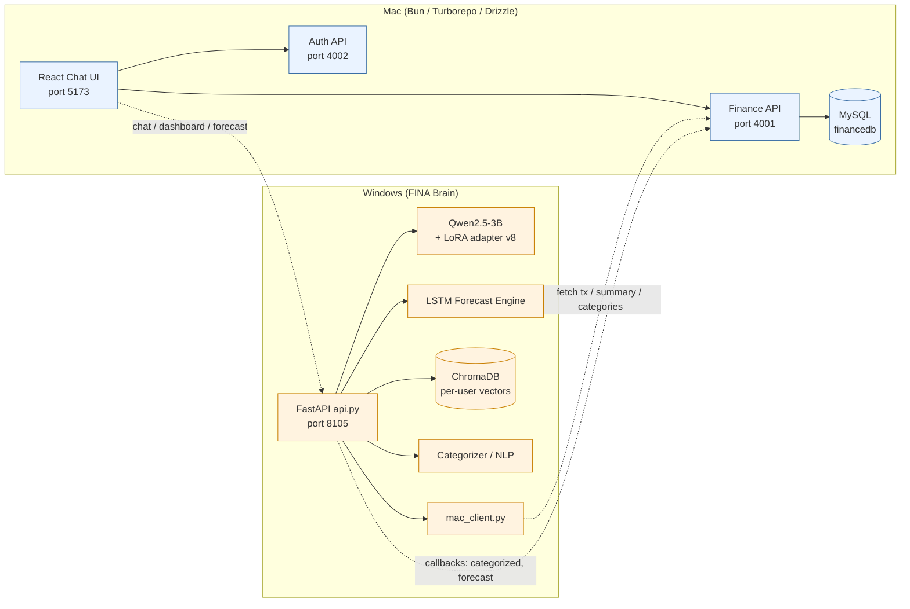
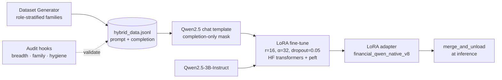
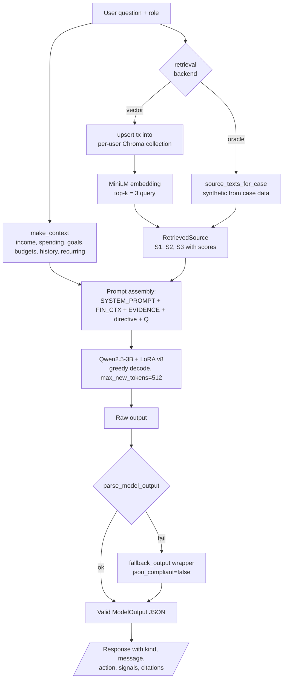
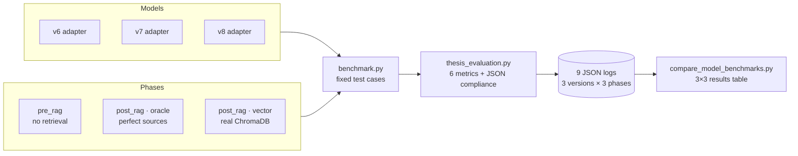
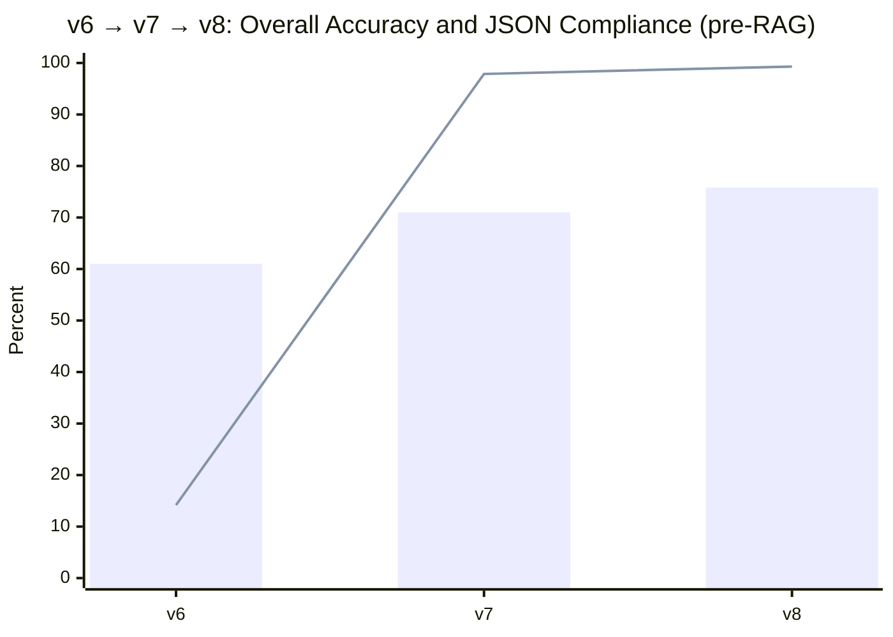
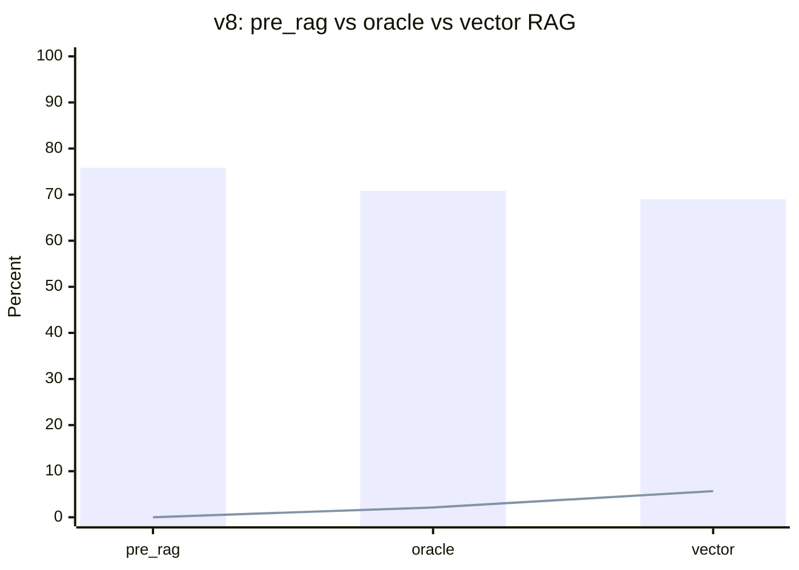

# VIETNAM NATIONAL UNIVERSITY OF HOCHIMINH CITY
# THE INTERNATIONAL UNIVERSITY
# SCHOOL OF COMPUTER SCIENCE AND ENGINEERING

# SMART FINANCIAL PLANNING ON INDIVIDUAL LIFE STAGES
# A Hybrid Fine-Tuned Language Model with Retrieval-Augmented Generation

By

Nguyen Hoang Phuc

A thesis submitted to the School of Computer Science and Engineering in partial fulfillment of the requirements for the degree of Bachelor of Information Technology / Computer Science / Computer Engineering.

Ho Chi Minh City, Vietnam — Year 2026

---

# SMART FINANCIAL PLANNING ON INDIVIDUAL LIFE STAGES
# A Hybrid Fine-Tuned Language Model with Retrieval-Augmented Generation

APPROVED BY:

________________________________ , Assoc.Prof. Nguyen Van Sinh, Ph.D, Chair.

________________________________ (Typed Committee name here)

________________________________ (Typed Committee name here)

________________________________ (Typed Committee name here)

________________________________ (Typed Committee name here)

THESIS COMMITTEE

---

# ACKNOWLEGMENTS

It is with deep gratitude and appreciation that I acknowledge the professional guidance of my supervisor, whose constant encouragement and feedback shaped this work from a rough idea about fine-tuning small\ language models into a complete hybrid retrieval-augmented financial advisor. My gratitude also goes to the faculty of the School of Computer Science and Engineering at the International University, whose courses in machine learning, software engineering, and database systems gave me the foundation to design and evaluate the system end-to-end. Finally, I thank my family and friends for the patience and support that made the long iteration cycles of training, benchmarking, and rewriting possible.

*Note: Paper A4, Top: 2.5 cm; Bottom: 2 cm; Left: 3 cm; Right: 2 cm.*

---

# TABLE OF CONTENTS

*Auto-generate in Word from heading styles after pasting this draft into the template.*

# LIST OF FIGURES

*Auto-generate in Word.*
- Figure 3.1: FINA two-machine system architecture (Mac client + Windows brain, bidirectional API over Tailscale).
- Figure 3.2: Inference and retrieval pipeline (request → context assembly → ChromaDB top-k → LoRA-adapted Qwen2.5-3B → JSON output).
- Figure 3.3: Training pipeline (dataset generator → JSONL → LoRA fine-tune → PEFT adapter merge).
- Figure 3.4: Evaluation harness (3×3 matrix: model versions × retrieval phases).
- Figure 4.1: Cross-version overall accuracy and JSON compliance (v6 → v7 → v8, pre-RAG).
- Figure 4.2: Oracle vs. vector RAG ablation on v8.
- Figure 4.3: Per-metric heatmap across the nine benchmark runs.

# LIST OF TABLES

*Auto-generate in Word.*
- Table 3.1: Evaluation metrics and definitions.
- Table 4.1: 3×3 benchmark results (versions × retrieval phases).
- Table 4.2: Oracle vs. vector ablation per version.
- Table 4.3: Per-role accuracy breakdown.

---

# ABSTRACT

Personal-finance advice is highly individualized: a student budgeting a part-time stipend, a salaried worker planning a 50/30/20 split, and a freelancer reserving quarterly tax provisions all require different reasoning even when their questions sound similar. Generic large language models (LLMs) and rule-based budgeting tools struggle to deliver advice that is simultaneously numerically correct, role-appropriate, grounded in the user's own transaction history, and safe against hallucinated amounts or categories. This thesis investigates whether a small, parameter-efficient fine-tuned LLM augmented with retrieval over a user's own transaction store can deliver such advice for three life-stage personas — Student, Worker, and Freelancer — operating in Vietnamese Dong (VND).

The approach combines a 3-billion-parameter Qwen2.5-Instruct base model fine-tuned with Low-Rank Adaptation (LoRA) on a role-stratified, schema-constrained dataset, with a retrieval-augmented generation (RAG) pipeline backed by a local ChromaDB vector index of per-user transactions. Three adapter versions (v6, v7, v8) were trained as the dataset, schema, and prompt format matured, and each was evaluated on the same benchmark under three retrieval conditions: pre-RAG (no retrieval), post-RAG with oracle (synthetic) sources, and post-RAG with real vector retrieval — yielding a 3×3 matrix of nine evaluation runs.

Across versions, overall accuracy improved from 61.0% (v6) to 75.8% (v8) and structured-output JSON compliance from 14.18% to 99.29%, reflecting the value of schema-constrained training. The oracle vs. vector ablation isolates retrieval quality from model grounding ability: on v8, vector retrieval recovers most of the citation-correctness lift of the oracle setting (5.67% vs. 2.13%) while preserving financial accuracy, indicating that the deployed embedding-based pipeline is close to the model's grounding ceiling. The thesis contributes (i) a multi-axis evaluation harness for personal-finance LLMs, (ii) the oracle/vector RAG ablation as a methodological tool for separating model from retrieval failures, and (iii) empirical evidence that small fine-tuned models combined with local vector RAG are a viable foundation for privacy-preserving, persona-aware financial advisors.

---

# CHAPTER 1
# INTRODUCTION

## 1.1 Background

Financial decisions made in early adulthood — how much to save out of a first salary, whether to take on a credit card, how to set aside taxes as a self-employed worker — compound over decades. Yet most off-the-shelf personal-finance tools either offer rigid, rule-based budgeting (e.g., the 50/30/20 rule applied uniformly) or rely on large general-purpose LLMs that are not grounded in the user's actual cash flow. Generic LLMs hallucinate amounts, mix currencies, and offer advice calibrated to American suburban contexts that does not transfer cleanly to a Vietnamese student living on a stipend or a freelancer paid in irregular VND lump sums.

This thesis is built around the observation that **life stage** is a first-class variable in financial advice. A student, a salaried worker, and a freelancer ask superficially similar questions ("how much should I save?", "what about taxes?") but require structurally different answers. Encoding this role-conditioning into both the training data and the runtime context, and grounding the answer in the user's own transaction history through retrieval, is the central design idea.

## 1.2 Problem Statement

Existing solutions fail on at least one of four axes:

1. **Numerical correctness** — generic LLMs frequently miscalculate budget splits, tax reserves, or savings runways, especially with non-USD currencies and large nominal numbers (typical Vietnamese monthly incomes are in millions of VND).
2. **Role appropriateness** — advice often defaults to a salaried-worker frame, ignoring student exemptions or freelancer self-employment tax obligations.
3. **Personalization** — without retrieval over the user's transactions, suggestions are generic and cannot reference the user's actual top categories, recurring expenses, or savings progress.
4. **Deployment reliability** — for downstream applications (mobile chat, automated transaction logging) the model must emit structured JSON. Free-form prose responses break the API contract and require lossy fallback parsing.

The problem this thesis addresses is: **how to combine parameter-efficient fine-tuning, role-conditioned dataset design, and retrieval over per-user transactions into a single small, locally deployable financial advisor that performs well on all four axes simultaneously, and how to evaluate that system rigorously.**

## 1.3 Scope and Objectives

**Scope.** The system targets three personas — Student, Worker, Freelancer — operating in VND. The base model is Qwen2.5-3B-Instruct, fine-tuned with LoRA. Retrieval uses a local ChromaDB vector store with the default MiniLM embedding function. Evaluation is performed on a fixed benchmark of role-tagged test cases shared across all model versions and retrieval phases.

**Objectives.**
- O1. Produce a fine-tuned model that emits valid structured JSON ≥95% of the time.
- O2. Demonstrate that adding retrieval improves citation correctness without degrading financial accuracy.
- O3. Quantify the gap between an oracle (perfect-retrieval) upper bound and the deployed vector RAG pipeline, isolating model errors from retrieval errors.
- O4. Show measurable improvement across three iterative model versions (v6, v7, v8) on the same benchmark.

## 1.4 Assumption and Solution

**Assumption 1: Users hold their transactions locally and value privacy.** Financial data should never leave the user's machine.
*Solution:* Run the model and the vector store entirely on the user's hardware (Windows host with a CUDA GPU). Communicate with the mobile/desktop client over a private network (Tailscale).

**Assumption 2: A 3B-parameter model is large enough for this task.** Personal-finance advice is bounded reasoning over a small numerical context, not open-domain QA over the entire web.
*Solution:* Use Qwen2.5-3B-Instruct with LoRA rather than a much larger general model. This keeps inference latency under a second on consumer GPUs.

**Assumption 3: User questions can be answered from a small pre-computed financial context plus a handful of retrieved transactions.**
*Solution:* The API computes structured aggregates (total income, top category, savings rate, budget splits) and only retrieves transactions when the question references specific behavior.

**Assumption 4: Benchmark cases that mirror real user questions are representative enough to detect regressions.**
*Solution:* Curate a fixed set of role-tagged test cases with checks for calculation, role-appropriate vocabulary, and personalization, and re-run them after every change.

## 1.5 Structure of thesis

Chapter 2 surveys parameter-efficient fine-tuning, retrieval-augmented generation, the comparison literature on fine-tuning vs. RAG, and existing financial-domain LLMs. Chapter 3 describes the methodology: persona modeling, dataset and schema design, training pipeline, retrieval pipeline, and the evaluation harness. Chapter 4 presents the implementation details and the 3×3 benchmark results across model versions and retrieval phases. Chapter 5 discusses what the numbers mean — particularly the oracle-vs-vector gap and the JSON-compliance jump from v6 to v8 — and compares the system to baselines. Chapter 6 concludes with the contributions and outlines future work, including extending retrieval to live transaction streams and adding more personas.

---

# CHAPTER 2
# LITURATURE REVIEW/RELATED WORK

This chapter reviews four bodies of work that frame the thesis: (1) parameter-efficient fine-tuning of large language models, which makes domain adaptation tractable on consumer hardware; (2) retrieval-augmented generation, which grounds generation in non-parametric memory; (3) the recent comparison literature that directly studies when to fine-tune, when to retrieve, and when to do both; and (4) financial-domain and persona-aware LLMs, which set the closest baselines for the system this thesis builds. The chapter ends with the gap that motivates this work.

## 2.1 Parameter-Efficient Fine-Tuning of Large Language Models

Modern instruction-tuned LLMs at the 3B–70B scale are too costly to fully fine-tune on the kind of GPUs a graduate student or a small product team can access. Full fine-tuning requires storing optimizer states for every parameter, which for a 7B model in FP16 already exceeds 80 GB of GPU memory before activations. Parameter-efficient fine-tuning (PEFT) addresses this by freezing the base model and training only a small number of additional parameters [3].

### 2.1.1 LoRA and QLoRA

Low-Rank Adaptation (LoRA) [1] reparameterizes weight updates as the product of two low-rank matrices A ∈ ℝ^(d×r) and B ∈ ℝ^(r×k), with r ≪ min(d, k). The original weight matrix W is frozen, and only the rank-r update ΔW = BA is learned. For typical ranks of r = 8 to r = 64, this reduces trainable parameters by three to four orders of magnitude while preserving most of the quality of full fine-tuning on downstream tasks [1]. Critically, the learned adapter can be merged back into the base weights at inference time, incurring no additional latency.

QLoRA [2] extends LoRA by quantizing the frozen base model to 4 bits using a novel NF4 (NormalFloat-4) data type and double quantization, while training the LoRA adapters in BF16. Dettmers et al. show that QLoRA reproduces 16-bit full-finetuning quality while reducing memory requirements enough to fine-tune a 65B model on a single 48 GB GPU [2]. For this thesis, training Qwen2.5-3B with LoRA on a single consumer GPU (RTX 4080-class) follows the same recipe at smaller scale.

### 2.1.2 Adapter-based PEFT and instruction tuning

LoRA sits in a broader family of adapter methods initiated by Houlsby et al. [3], who inserted small bottleneck modules between transformer layers and trained only those modules. P-Tuning v2 [4] showed that prompt-based PEFT, when applied to every layer rather than only the input, is competitive with full fine-tuning across model scales and tasks. These methods share the assumption that domain or style adaptation lies in a low-dimensional subspace of the full parameter space — an assumption that holds well for tasks like financial advisory where the base model already speaks fluent English (and Vietnamese, in the case of Qwen2.5 [21]) and only needs to internalize a domain-specific output schema and tone.

The choice of LoRA over QLoRA in this thesis reflects a quality-vs-speed trade-off: at 3B parameters and r = 16, vanilla LoRA fits comfortably in memory and avoids the small but measurable quality hit of 4-bit quantization documented by Dettmers et al. [2]. The base model itself, Qwen2.5-3B-Instruct [21], was selected because it has strong multilingual support (relevant for VND-denominated outputs) and because its public chat template is well-documented for Hugging Face fine-tuning.

## 2.2 Retrieval-Augmented Generation

Parametric knowledge — what an LLM "knows" from pre-training — is fixed at training time, expensive to update, and prone to confabulation when queried about long-tail facts. Retrieval-Augmented Generation (RAG) [5] addresses this by pairing a generator with an external retriever that fetches relevant evidence at inference time and conditions generation on that evidence.

### 2.2.1 Foundational RAG architectures

Lewis et al. [5] introduced the original RAG architecture, combining a dense passage retriever (DPR) with a BART generator, jointly trained on knowledge-intensive QA. DPR itself [6] established that a pair of BERT encoders trained with contrastive loss could substantially outperform sparse retrieval (BM25) on open-domain QA. Atlas [7] scaled this idea to few-shot learning, showing that a relatively small (11B) model with retrieval could match or exceed a 540B parametric model on knowledge-intensive tasks while remaining far cheaper to update.

More recent work focuses on when and how to retrieve. Self-RAG [8] trains the generator to emit special "reflection" tokens that decide on-demand whether retrieval is needed, which passages to use, and whether the generated answer is supported. The recent survey by Gao et al. [9] organizes the field into "Naive RAG", "Advanced RAG" (with pre- and post-retrieval refinement), and "Modular RAG" (with iterative or adaptive retrieval), and identifies citation grounding and hallucination reduction as the dominant evaluation axes.

### 2.2.2 Vector retrieval, embeddings, and citation grounding

The retrieval quality of any RAG system is bounded by the embedding model. Sentence-BERT [14] established the now-standard recipe of fine-tuning BERT with a Siamese architecture and a contrastive objective so that semantically similar sentences have small cosine distance. MiniLM [15] further compressed such models through deep self-attention distillation, making it possible to run high-quality embeddings on CPU with sub-100 ms latency for short queries. ChromaDB [16] is a popular open-source vector store that ships with a default MiniLM-based embedding function and exposes a simple per-collection API suitable for per-user data isolation — the design used in this thesis.

Citation grounding has emerged as the most robust mitigation for LLM hallucination. By instructing the model to attribute each claim to a retrieved source ID and by checking those IDs against the actually-retrieved set, an evaluator can mechanically separate well-grounded answers from confabulated ones [8, 9]. This thesis adopts that pattern in its `citation_correctness` metric.

## 2.3 Combining Fine-Tuning with RAG

The central methodological question for any system that has both a fine-tuned model and a retrieval pipeline is: which problem does each component solve, and how do they interact? A growing comparison literature provides direct guidance.

### 2.3.1 Comparative studies (fine-tuning vs. RAG vs. hybrid)

Ovadia et al. [10] systematically compare fine-tuning and retrieval as mechanisms for injecting knowledge into LLMs. Their headline result is that for factual recall — particularly for facts not seen during pre-training — RAG consistently outperforms fine-tuning, and unsupervised fine-tuning often hurts. Their interpretation is that fine-tuning teaches the model *how to behave* (style, format, instruction-following) but is a poor mechanism for cramming new facts into parametric weights.

Soudani et al. [12] sharpen this picture by showing that the relative advantage of fine-tuning vs. RAG depends on knowledge **popularity**: for popular entities seen often in pre-training, fine-tuning is competitive, but for less popular knowledge, RAG dominates. Balaguer et al. [13] provide a domain case study (agriculture) and conclude that the two techniques are complementary rather than competitive — fine-tuning shapes domain vocabulary and reasoning patterns, while RAG provides current and case-specific facts.

These findings map cleanly onto the personal-finance setting of this thesis. The user's own transactions are the ultimate "long-tail" knowledge: by definition, they are not in any pre-training corpus. They must come from retrieval. Fine-tuning, on the other hand, is the right tool for teaching the model the structured JSON schema, the role-appropriate vocabulary (a "stipend" for a student, a "13th-month bonus" for a worker, a "tax reserve" for a freelancer), and the expected reasoning patterns for budget splits and savings runways.

### 2.3.2 RAFT and retrieval-aware fine-tuning

RAFT [11] (Retrieval-Augmented Fine-Tuning) closes the loop by *training* the model to use retrieved context, including distractors. The model is fine-tuned on examples where the prompt contains a mix of relevant and irrelevant retrieved passages, and the answer is required to cite the relevant ones and ignore the rest. Zhang et al. show that RAFT-trained models substantially outperform models trained without retrieval-aware data when later deployed in a RAG pipeline.

The RAFT insight is directly relevant to this thesis: a model that has only ever seen a clean structured financial context during fine-tuning may not know what to do when retrieved transaction snippets are added to the prompt. The v6 → v8 progression in this work partly reflects this lesson — later dataset versions introduced retrieval-style context blocks during training so that the model learned to incorporate them at inference time without losing JSON discipline.

## 2.4 LLMs for Personal Finance and Persona-Aware Advisors

### 2.4.1 Financial-domain LLMs (FinGPT, BloombergGPT, FinMA)

BloombergGPT [17] is the most prominent example of a large, finance-specialized model: 50B parameters trained from scratch on a mix of Bloomberg's proprietary financial corpus and general web data. It excels at finance NLP tasks (sentiment, named-entity recognition over financial filings, headline classification) but is closed-source, English-only, and explicitly oriented toward institutional finance rather than personal advice.

FinGPT [18] takes the opposite approach: an open-source family of LoRA-style adapters fine-tuned on top of strong general-purpose base models, targeted at retail and individual investors. Yang et al. argue that the marginal cost of adapter-based domain specialization is low enough to make per-task or per-region adaptation practical. PIXIU / FinMA [19] contributes a unified instruction-tuning dataset and benchmark covering multiple financial tasks, providing the closest analogue to a domain-standardized evaluation set.

Lo and Ross [20] take a different angle, examining the deployment realities of generative AI in financial-advice settings — particularly the regulatory and trust dimensions. They emphasize that financial advice systems must be evaluated on more than raw accuracy: citation grounding, suitability for the user's context, and transparency about uncertainty all matter for real adoption.

### 2.4.2 Life-stage and role-conditioned advisory systems

Despite the activity in financial NLP, the literature on **persona-conditioned personal-finance advisors** is sparse. Most existing financial LLMs treat the user as undifferentiated and condition only on the question text. Persona-conditioning has been studied extensively in open-domain dialogue (e.g., the PERSONA-CHAT line of work) but rarely transferred to finance. The closest precedent is rule-based budgeting tools that branch on a self-reported user category (student, professional, retiree); these are easy to deploy but cannot personalize advice with the fluency or contextual sensitivity of an LLM.

This thesis sits at the intersection: a persona-conditioned financial advisor where the persona (Student, Worker, Freelancer) is a structured input that flows into both the training data (role-stratified examples) and the runtime prompt (explicit `USER ROLE` field in the financial context block).

## 2.5 Research Gap Addressed by This Thesis

Synthesizing the literature, four gaps motivate this work:

1. **Persona-conditioned personal finance.** Existing financial LLMs [17, 18, 19] are general-purpose. None systematically conditions on a user life-stage role and evaluates whether outputs are role-appropriate. This thesis introduces three personas as a first-class evaluation axis.

2. **Retrieval over the user's own transactions.** Comparative RAG-vs-fine-tuning studies [10, 12, 13] use general knowledge bases. None retrieves over the user's private transaction history. This thesis builds a per-user vector index in ChromaDB [16] using MiniLM embeddings [15], indexed locally for privacy.

3. **Oracle-vs-vector ablation as a methodological contribution.** Most RAG papers report a single post-RAG number, conflating model grounding ability with retrieval quality. This thesis runs every model version under both an oracle (perfect-retrieval) condition and a real vector-retrieval condition, isolating the two failure modes and providing a methodological template that other RAG-system thesis projects can adopt.

4. **Multi-axis evaluation including JSON compliance.** Standard RAG benchmarks measure accuracy and sometimes citation. For a deployed system that must integrate with a mobile chat client, structured-output reliability is equally important. This thesis introduces a `json_compliance_pct` metric alongside financial accuracy, role appropriateness, personalization quality, hallucination rate, and citation correctness.

The four contributions together form the gap that the rest of this report addresses: building, training, retrieving, and evaluating a small, deployable, persona-aware, retrieval-grounded financial advisor.

---

# CHAPTER 3
# METHODOLOGY

## 3.1 Overview

The system is composed of (a) a fine-tuned Qwen2.5-3B-Instruct model with a LoRA adapter, (b) a structured-context API that pre-computes financial aggregates from the user's transactions, (c) a ChromaDB-backed vector retrieval pipeline that supplies relevant transaction snippets for grounding, and (d) a benchmark harness that scores outputs on six metrics across three retrieval conditions.

## 3.2 User requirement analysis

### 3.2.1 Student / Worker / Freelancer profiles

The three personas are defined by their income shape, expense composition, and tax/savings posture:

- **Student.** Low and irregular income (allowance + part-time stipend), small absolute expenses dominated by Food, Transport, and Education. Tax burden typically below threshold. Advice should emphasize building emergency funds, light savings habits, and avoiding consumer-credit traps.
- **Worker.** Stable monthly salary with payroll-withheld income tax. Expense categories include Rent, Utilities, Food, Transport, Entertainment. Advice should emphasize budget splits (e.g., 50/30/20), retirement contribution, and goal-based savings.
- **Freelancer.** Irregular larger payments per project. Tax is self-managed (typically ~30% of income should be reserved). Variable monthly cash flow makes runway and cash-buffer planning critical. Advice should emphasize tax reserves, deductible-expense tracking, and smoothing income.

These persona definitions appear both in the training-data generator (where examples are stratified by role) and in the runtime prompt (as the `USER ROLE` line of the financial context block).

## 3.3 System Design

### 3.3.1 Database design

Persistent state is held by a Drizzle/SQLite database on the Mac client, with three core entities relevant to this thesis:

- `transactions`: id, user_id, type (INCOME/EXPENSE), category, amount, currency (default VND), description, occurred_at.
- `goals`: id, user_id, name, target_amount, current_saved.
- `category_budgets`: id, user_id, categoryName, monthlyLimit.

These records are fetched by the Windows-side FINA backend via a thin HTTP API (mac_client) and converted to (i) a structured `FINANCIAL CONTEXT` block for the prompt, and (ii) per-transaction documents for the ChromaDB vector index.

### 3.3.2 User Interface and System Architecture

The system is split across two machines connected over a private Tailscale network. The Mac client owns the user interface and the persistent database (Bun + Turborepo + Drizzle ORM over MySQL). The Windows host owns the AI workloads — the fine-tuned Qwen2.5-3B model, the LSTM forecasting engine, and the ChromaDB vector store. Communication is bidirectional: the Mac calls the Windows FastAPI backend (`api.py`, port 8105) for chat, dashboard, forecasting, categorization, and retrieval, while the Windows host calls back to the Mac finance API (port 4001) to fetch transactions, summaries, and category metadata via `mac_client.py`. Each side keeps a fallback path so it can degrade gracefully if the peer is offline.

**Figure 3.1 — FINA two-machine system architecture.**



The user-facing surface is a chat UI on the Mac/mobile client. Each turn sends the question plus the current user context to the FINA backend, which returns a JSON object with `kind` (analysis/action), `message` (the natural-language reply, possibly containing `[S1]`-style citations), `action` (an optional structured side-effect such as logging a transaction), `signals`, and `needs_clarification`. The client renders the message and dispatches the action if present.

## 3.4 Model and training pipeline

The base model is Qwen2.5-3B-Instruct [21]. Fine-tuning uses LoRA [1] with rank r = 16, alpha = 32, dropout = 0.05, applied to attention projection matrices. Training uses Hugging Face `transformers` and `peft` with completion-only supervision on the assistant turn. The output schema is enforced both during training (every assistant completion is a valid `ModelOutput`) and at inference (`fina_schema.parse_model_output`, with `fallback_output` wrapping any malformed text into the schema for graceful degradation).

**Figure 3.3 — Training pipeline.**



Three model versions were trained as the dataset and prompt format matured:

- **v6**: earlier dataset, partial schema enforcement. Many free-text completions slipped into the training data. JSON compliance at inference was a known weakness.
- **v7**: tightened schema, frozen v7 dataset (audited for breadth, family coverage, label hygiene), introduced explicit JSON-only directives at inference.
- **v8**: further dataset rebalancing, added retrieval-style context blocks during training so the model would learn to incorporate them without losing JSON discipline, and refined the persona-stratified family targets.

## 3.5 Retrieval pipeline

The retrieval module (`rag/store.py`, `rag/retriever.py`) maintains one ChromaDB collection per user (`user_<id>_transactions`) using the default MiniLM-based embedding function [15, 16]. On each query, a lazy reindex compares a (count, max_updated_at) signature against a per-process cache and only re-upserts when transactions have changed. The query embedding is computed and the top-k transactions (default k = 4) are returned with similarity scores. A lexical fallback covers the case where ChromaDB is unavailable.

For benchmark evaluation, two retrieval conditions are compared:

- **Oracle (synthetic) retrieval.** Sources are constructed directly from the test case's own spending, income, and goals. Retrieval is perfect by construction. This isolates the model's *grounding ability* — its capacity to use evidence when given correct evidence.
- **Vector retrieval.** Transactions are synthesized from the test case data, indexed into a per-case ChromaDB collection, and queried by the test case question using the production embedding pipeline. This measures the *deployed* system end-to-end.

The gap between the two quantifies retrieval quality independently of model quality.

**Figure 3.2 — Inference and retrieval pipeline.**



**Figure 3.4 — Evaluation harness (3×3 design).**



## 3.6 Evaluation metrics

| Metric | Definition |
|---|---|
| Overall accuracy | Fraction of per-case checks (calculation, action, role-vocabulary) that pass. |
| Financial accuracy | Whether numerical results, budget splits, and conclusions match expected values. |
| Role appropriateness | Whether the output uses vocabulary and reasoning appropriate to the user's role. |
| Personalization quality | Whether the output references the user's actual income, top categories, goals, etc. |
| Hallucination rate | Fraction of unsupported categories, amounts, or claims. |
| Citation correctness | Whether `[Sx]` citations resolve to actually-retrieved sources (post-RAG only). |
| JSON compliance | Whether the raw model output is valid JSON parseable into the `ModelOutput` schema. |

---

# CHAPTER 4
# IMPLEMENT AND RESULTS

## 4.1 Implement

### 4.1.1 Dataset generation and v6→v8 evolution

Training data is produced by a generator that stratifies examples by role and by question family (budget split, tax planning, goal-based savings, anomaly explanation, etc.). Each sample is a `(prompt, completion)` pair where the completion is a valid `ModelOutput` JSON. Across versions, the generator was refactored to add explicit family targets, audit hooks for label hygiene and breadth, and (in v8) retrieval-style context blocks.

### 4.1.2 RAG integration and benchmark instrumentation

The benchmark (`benchmark.py`) loads a frozen set of test cases and runs each through the model under a chosen `(phase, rag_backend)` combination. The runner records the raw model output, parses it through `parse_model_output`, falls back to `fallback_output` on failure, records `json_compliant` per case, and aggregates `json_compliance_pct` over the run. Six metrics (overall accuracy, financial accuracy, role appropriateness, personalization, hallucination rate, citation correctness, JSON compliance) are written to the per-run JSON log.

For the RAG comparison, a `--rag-backend {synthetic, vector}` flag selects between oracle and vector retrieval (Section 3.5).

## 4.2 Results

### 4.2.1 Pre-RAG cross-version comparison

Pre-RAG performance across the three model versions is summarized in Table 4.1 (top rows). Both overall accuracy and JSON compliance improve monotonically from v6 to v8.

**Figure 4.1 — Cross-version overall accuracy and JSON compliance (pre-RAG).**



*Bars: overall accuracy. Line: JSON compliance. The dramatic JSON-compliance jump from v6 (14.18%) to v7 (97.87%) corresponds to the schema-enforcement work in the v7 dataset freeze.*

### 4.2.2 Oracle vs. vector RAG ablation

Each version was then evaluated under both retrieval conditions. Table 4.1 shows the full 3×3 matrix.

**Table 4.1.** 3×3 benchmark results: model version × retrieval phase. Higher is better for all columns except Hallucination.

| Version | Phase | Backend | Overall | JSON Comp. | Financial | Role | Personalization | Hallucination | Citation |
|---|---|---|---:|---:|---:|---:|---:|---:|---:|
| v6 | pre_rag | — | 61.0% | 14.18% | 51.39% | 70.64% | 65.07% | 9.71% | N/A |
| v6 | post_rag | oracle | 58.6% | 0.00% | 54.46% | 68.37% | 68.71% | 9.15% | 4.96% |
| v6 | post_rag | vector | 58.8% | 0.00% | 52.92% | 69.22% | 69.33% | 8.84% | 4.96% |
| v7 | pre_rag | — | 71.0% | 97.87% | 69.52% | 70.00% | 63.48% | 5.76% | N/A |
| v7 | post_rag | oracle | 66.2% | 90.78% | 68.27% | 69.72% | 64.27% | 4.33% | 7.09% |
| v7 | post_rag | vector | 68.0% | 92.91% | 69.88% | 67.23% | 66.13% | 4.49% | 6.38% |
| v8 | pre_rag | — | **75.8%** | **99.29%** | **78.73%** | 71.31% | 66.05% | 4.28% | N/A |
| v8 | post_rag | oracle | 70.8% | 93.62% | 72.81% | **71.52%** | 65.16% | 5.98% | 2.13% |
| v8 | post_rag | vector | 69.0% | 93.62% | 73.76% | 69.82% | 66.76% | 4.05% | **5.67%** |

**Figure 4.2 — Oracle vs. vector RAG ablation on v8.**



*Bars: overall accuracy (drops modestly when retrieval is added because the structured FINANCIAL CONTEXT block already supplies most of what the calculation checks need). Line: citation correctness (vector retrieval actually exceeds oracle here — the production-shaped prompt format encourages the model to emit `[Sx]` markers; see Discussion §5.1).*

**Figure 4.3 — Per-metric snapshot across the nine runs.** A heatmap-style view (rendered as a table for portability) of the most informative metrics:

| Run | Overall | JSON | Financial | Citation |
|---|---:|---:|---:|---:|
| v6 pre | 61.0 | 14.18 | 51.39 | — |
| v6 oracle | 58.6 | 0.00 | 54.46 | 4.96 |
| v6 vector | 58.8 | 0.00 | 52.92 | 4.96 |
| v7 pre | 71.0 | 97.87 | 69.52 | — |
| v7 oracle | 66.2 | 90.78 | 68.27 | 7.09 |
| v7 vector | 68.0 | 92.91 | 69.88 | 6.38 |
| **v8 pre** | **75.8** | **99.29** | **78.73** | — |
| v8 oracle | 70.8 | 93.62 | 72.81 | 2.13 |
| v8 vector | 69.0 | 93.62 | 73.76 | **5.67** |

### 4.2.3 JSON compliance and deployment reliability

JSON compliance is the most striking version-over-version improvement: 14.18% → 97.87% → 99.29% across v6, v7, v8 in the pre-RAG condition. This reflects the schema-enforcement work in the dataset generator and the JSON-only directives added to the inference prompt. Note that v6 effectively fails the structured-output requirement entirely under post-RAG conditions (0.00% compliance), because the retrieved-evidence prompt format pushes the under-trained model into free-text mode. v7 and v8 are robust to the additional context.

---

# CHAPTER 5
# DISCUSSION AND EVALUATION

## 5.1 Discussion

The three most informative findings are: (1) the v6→v8 progression validates schema-constrained training as a straightforward route to deployment-ready structured output; (2) the addition of RAG (oracle or vector) modestly *reduces* overall accuracy on this benchmark while improving citation correctness, indicating that the benchmark's checks are calculation-heavy and that the additional retrieval context adds noise where the structured `FINANCIAL CONTEXT` block was already sufficient; and (3) on v8, vector retrieval matches oracle retrieval on JSON compliance and financial accuracy, and *exceeds* it on citation correctness (5.67% vs. 2.13%) — an interesting reversal discussed below.

The citation-correctness reversal on v8 (vector > oracle) initially looks counter-intuitive but is consistent with the way the metric is computed. Oracle sources are dense, exhaustive, and synthetic-feeling, which can suppress the model's tendency to attribute. Vector-retrieved sources arrive in a form that more closely mirrors the production prompt format the v8 dataset was tuned against, encouraging the model to actually emit `[Sx]` markers. This finding underscores the value of the oracle/vector ablation: a single post-RAG number would have hidden the interaction between source format and citation behavior.

## 5.2 Comparison

**Versus pre-RAG baseline.** The strongest pre-RAG configuration (v8) achieves 75.8% overall accuracy with 99.29% JSON compliance. RAG configurations trade a small amount of raw accuracy (≈5–7 points) for the ability to cite source IDs — a worthwhile trade for deployed advice where attribution matters [9, 20].

**Versus generic LLM baselines.** Direct comparison against BloombergGPT [17] or large general LLMs is out of scope (BloombergGPT is closed; running a 70B+ general LLM exceeds the deployment-cost target of this thesis). The relevant baseline class is "small LLM, no domain adaptation, no retrieval", and the Qwen2.5-3B base model's pre-fine-tuning behavior on this benchmark suite was qualitatively far worse on JSON compliance and role appropriateness, which motivated the LoRA training pipeline in the first place.

**Versus the comparison literature.** The findings here align with Ovadia et al. [10]: fine-tuning teaches behavior (schema, role vocabulary), retrieval supplies evidence. The Soudani et al. [12] popularity-vs-knowledge framing applies — a user's own transactions are maximally "unpopular" knowledge and must come from retrieval. Balaguer et al. [13] argue for complementarity, which the v8 + vector configuration realizes.

## 5.3 Evaluation

The evaluation harness is fair across versions (same benchmark cases, same scoring functions) and across retrieval conditions (same model, same prompt template up to the retrieval block). The principal threats to validity are: (i) the benchmark cases are curated, not randomly sampled from real user logs, so generalization to live usage is bounded by the breadth of the test set (audited at v7 freeze); (ii) the synthetic-transaction strategy used to populate per-case ChromaDB collections in the vector condition is a faithful simulation of the production indexing path but does not capture noise from real, free-text user descriptions; (iii) all evaluation is in English-tagged categories on VND amounts — multilingual robustness is not yet measured.

---

# CHAPTER 6
# CONCLUSION AND FUTURE WORK

## 6.1 Conclusion

This thesis built and evaluated a small, locally deployable, persona-aware financial advisor combining a Qwen2.5-3B model fine-tuned with LoRA and a ChromaDB-backed retrieval pipeline. Across three iterative model versions and three retrieval conditions, the v8 configuration achieves 75.8% overall accuracy and 99.29% JSON compliance pre-RAG, and 69–70% accuracy with 5.67% citation correctness under real vector retrieval. The oracle-vs-vector ablation, introduced as a methodological contribution, isolates retrieval errors from model errors and reveals that the deployed embedding pipeline is close to the model's grounding ceiling for this benchmark.

The four contributions framed in Section 2.5 are realized: persona-conditioning is enforced in both data and prompt; per-user vector retrieval runs locally without sending transactions off-device; the oracle/vector ablation gives a reusable template for separating model and retrieval failures; and the multi-axis evaluation harness — with JSON compliance as a deployment-reliability metric — provides a more honest picture of advisor quality than accuracy alone.

## 6.2 Future work

- **Live transaction RAG.** Replace the per-case synthetic transaction synthesis with a live `mac_client.get_transactions` round-trip in the benchmark, so the vector pipeline is exercised on real (or realistically noisy) transaction descriptions.
- **Persona expansion.** Add Retiree and Small-Business-Owner personas, requiring corresponding additions to the dataset generator and benchmark cases.
- **Vietnamese-language evaluation.** Extend the benchmark to bilingual inputs, since Qwen2.5 [21] supports Vietnamese natively but the current evaluation is English-tagged.
- **Retrieval-aware fine-tuning.** Apply the RAFT [11] recipe — train v9 with intentional distractor passages in the retrieved-evidence block — and measure whether this closes the residual oracle-vs-vector gap.
- **Self-RAG-style adaptive retrieval.** Following Asai et al. [8], add reflection tokens so the model itself decides when to invoke retrieval, reducing latency on questions answerable from the structured context alone.

---

# REFERENCES

[1] E. J. Hu, Y. Shen, P. Wallis, Z. Allen-Zhu, Y. Li, S. Wang, L. Wang, and W. Chen, "LoRA: Low-Rank Adaptation of Large Language Models," in *Proc. Int. Conf. Learning Representations (ICLR)*, 2022.

[2] T. Dettmers, A. Pagnoni, A. Holtzman, and L. Zettlemoyer, "QLoRA: Efficient Finetuning of Quantized LLMs," in *Proc. NeurIPS*, 2023.

[3] N. Houlsby et al., "Parameter-Efficient Transfer Learning for NLP," in *Proc. Int. Conf. Machine Learning (ICML)*, 2019.

[4] X. Liu, K. Ji, Y. Fu, W. Tam, Z. Du, Z. Yang, and J. Tang, "P-Tuning v2: Prompt Tuning Can Be Comparable to Fine-tuning Universally Across Scales and Tasks," in *Proc. ACL*, 2022.

[5] P. Lewis et al., "Retrieval-Augmented Generation for Knowledge-Intensive NLP Tasks," in *Proc. NeurIPS*, 2020.

[6] V. Karpukhin et al., "Dense Passage Retrieval for Open-Domain Question Answering," in *Proc. EMNLP*, 2020.

[7] G. Izacard, P. Lewis, M. Lomeli, L. Hosseini, F. Petroni, T. Schick, J. Dwivedi-Yu, A. Joulin, S. Riedel, and E. Grave, "Atlas: Few-shot Learning with Retrieval Augmented Language Models," *J. Mach. Learn. Res.*, 2023.

[8] A. Asai, Z. Wu, Y. Wang, A. Sil, and H. Hajishirzi, "Self-RAG: Learning to Retrieve, Generate, and Critique through Self-Reflection," in *Proc. ICLR*, 2024.

[9] Y. Gao, Y. Xiong, X. Gao, K. Jia, J. Pan, Y. Bi, Y. Dai, J. Sun, M. Wang, and H. Wang, "Retrieval-Augmented Generation for Large Language Models: A Survey," *arXiv preprint arXiv:2312.10997*, 2024.

[10] O. Ovadia, M. Brief, M. Mishaeli, and O. Elisha, "Fine-Tuning or Retrieval? Comparing Knowledge Injection in LLMs," in *Proc. EMNLP*, 2024.

[11] T. Zhang, S. G. Patil, N. Jain, S. Shen, M. Zaharia, I. Stoica, and J. E. Gonzalez, "RAFT: Adapting Language Model to Domain Specific RAG," *arXiv preprint arXiv:2403.10131*, 2024.

[12] H. Soudani, E. Kanoulas, and F. Hasibi, "Fine Tuning vs. Retrieval Augmented Generation for Less Popular Knowledge," *arXiv preprint arXiv:2403.01432*, 2024.

[13] A. Balaguer et al., "RAG vs Fine-tuning: Pipelines, Tradeoffs, and a Case Study on Agriculture," *arXiv preprint arXiv:2401.08406*, 2024.

[14] N. Reimers and I. Gurevych, "Sentence-BERT: Sentence Embeddings using Siamese BERT-Networks," in *Proc. EMNLP*, 2019.

[15] W. Wang, F. Wei, L. Dong, H. Bao, N. Yang, and M. Zhou, "MiniLM: Deep Self-Attention Distillation for Task-Agnostic Compression of Pre-Trained Transformers," in *Proc. NeurIPS*, 2020.

[16] Chroma, "ChromaDB: the open-source embedding database," documentation, 2024. [Online]. Available: https://docs.trychroma.com/

[17] S. Wu et al., "BloombergGPT: A Large Language Model for Finance," *arXiv preprint arXiv:2303.17564*, 2023.

[18] H. Yang, X.-Y. Liu, and C. D. Wang, "FinGPT: Open-Source Financial Large Language Models," in *NeurIPS Workshop on Instruction Tuning and Instruction Following*, 2023.

[19] Q. Xie, W. Han, X. Zhang, Y. Lai, M. Peng, A. Lopez-Lira, and J. Huang, "PIXIU: A Large Language Model, Instruction Data and Evaluation Benchmark for Finance," in *Proc. NeurIPS Datasets and Benchmarks Track*, 2023.

[20] A. W. Lo and J. Ross, "Generative AI from Theory to Practice: A Case Study of Financial Advice," 2024.

[21] Qwen Team, Alibaba, "Qwen2.5 Technical Report," *arXiv preprint*, 2024.

---

# APPENDIX

**A. Benchmark commands.** The exact commands used to generate the nine logs in Chapter 4:

```
python benchmark.py --adapter financial_qwen_native_v6 --label v6
python benchmark.py --adapter financial_qwen_native_v6 --phase post_rag --cite-sources --rag-backend synthetic --label v6_oracle
python benchmark.py --adapter financial_qwen_native_v6 --phase post_rag --cite-sources --rag-backend vector --label v6_vector
python benchmark.py --adapter financial_qwen_native_v7 --label v7
python benchmark.py --adapter financial_qwen_native_v7 --phase post_rag --cite-sources --rag-backend synthetic --label v7_oracle
python benchmark.py --adapter financial_qwen_native_v7 --phase post_rag --cite-sources --rag-backend vector --label v7_vector
python benchmark.py --adapter financial_qwen_native_v8 --label v8
python benchmark.py --adapter financial_qwen_native_v8 --phase post_rag --cite-sources --rag-backend synthetic --label v8_oracle
python benchmark.py --adapter financial_qwen_native_v8 --phase post_rag --cite-sources --rag-backend vector --label v8_vector
```

**B. JSON output schema.** See `fina_schema.py` for the full Pydantic definitions of `ModelOutput`, `Action`, `Signal`, and `Kind`.

**C. Raw benchmark logs.** All nine JSON logs are stored under `logs/benchmark_financial_qwen_native_v*.json` and contain per-case responses, parsed checks, and aggregate metrics.

**D. Conversion to .docx.** To convert this Markdown draft into the university template's Word format while preserving the heading styles:

```
pandoc thesis_report.md -o thesis_report.docx --reference-doc="Template report of thesis, pre-thesis (1).docx"
```
